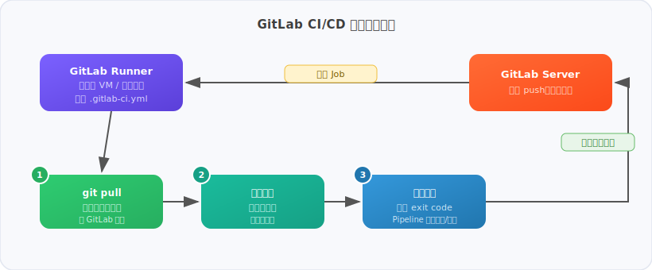

> *每次 push 完還要手動登進伺服器重啟服務？這篇文章會告訴你怎麼讓機器幫你做完這一切，以及在 Windows 上這件事有多難搞。*

---

## 什麼是 GitLab Runner？

GitLab Runner 是一個開源的代理程式（agent），負責執行 GitLab CI/CD pipeline 裡定義的 job。

整個流程長這樣：



簡單說：你寫程式、push 上去，剩下的 Runner 全包。

你在 `.gitlab-ci.yml` 裡寫什麼，Runner 就執行什麼。GitLab 本身只負責管理流程，Runner 才是真正動手做事的人。

---

## Runner 的三個層級

GitLab Runner 有三種作用範圍：

| 類型 | 作用範圍 | 設定位置 |
|---|---|---|
| **Shared Runner** | 整個 GitLab 平台 | 管理員設定 |
| **Group Runner** | 某個 Group 下所有專案 | Group Settings |
| **Project Runner** | 單一專案 | Project Settings |

公司 GitLab 通常會有 Shared 或 Group Runner，但它們的環境是公用的，不適合部署到特定機器。要部署到指定伺服器，就需要自己架 Project Runner。

---

## Executor：Runner 用什麼環境執行？

Runner 本身只是個殼，實際執行環境由 **Executor** 決定：

| Executor | 說明 | 適合情境 |
|---|---|---|
| `shell` | 直接在 Runner 所在機器執行 | 部署到固定伺服器 |
| `docker` | 每個 job 起一個乾淨的 Docker container | 建置、測試 |
| `kubernetes` | 跑在 K8s cluster 上 | 大規模 CI 環境 |
| `virtualbox` | 起 VM 執行 | 需要隔離的整合測試 |

本文使用 `shell` executor，因為目標是直接在 Windows 伺服器上部署。

---

## 在 Windows 上安裝 GitLab Runner

### 1. 下載執行檔

從官方下載 Windows 版：

```
https://gitlab-runner-downloads.s3.amazonaws.com/latest/binaries/gitlab-runner-windows-amd64.exe
```

建立專屬資料夾並重新命名：

```
C:\GitLab-Runner\gitlab-runner.exe
```

### 2. 在 GitLab 建立 Project Runner

1. 進到 GitLab 專案 → **Settings → CI/CD → Runners**
2. 點 **New project runner**
3. 勾選 **Run untagged jobs**
4. 點 **Create runner**，複製畫面上 `glrt-` 開頭的 token

### 3. 註冊 Runner

用**系統管理員**開啟 PowerShell，執行：

```powershell
cd C:\GitLab-Runner
.\gitlab-runner.exe register
```

依序填入：
- GitLab URL（完整網址，含 `https://`）
- Registration token
- Runner 名稱（隨意）
- Executor：`shell`

### 4. 啟動 Runner

安裝成背景服務（推薦，機器重啟後自動恢復）：

```powershell
.\gitlab-runner.exe install
.\gitlab-runner.exe start
```

臨時執行（測試用）：

```powershell
.\gitlab-runner.exe run
```

---

## Windows 踩坑實錄

> 以下是在 Windows VM 上部署 FastAPI 服務時，實際踩過的七個坑。

**專案背景：**
- 後端：FastAPI（Python）
- 前端：靜態 HTML
- 部署環境：Windows VM
- 版本控制：公司內部 GitLab

目標：每次 `git push` 到 `main` branch 後，伺服器自動拉取最新程式碼並重啟服務。

---

### 坑 #1：Runner 被公司 Group Runner 搶走

**症狀**

Pipeline 觸發後，跑的是公司的 Group Runner（Docker 環境），不是自己裝的 Runner，log 出現：

```
Preparing the "docker" executor
```

**原因**

公司 GitLab 的 Group Runner 是共用的，只要有任務就會搶先執行。

**解法**

幫自己的 Runner 加一個 tag，在 `.gitlab-ci.yml` 指定只用這個 tag 的 Runner：

Settings → CI/CD → Runners → 編輯 Runner → 加上 tag，例如 `windows-local`

```yaml
deploy:
  tags:
    - windows-local
```

> **教訓**：只要有自訂 Runner，`.gitlab-ci.yml` 一定要加 `tags`，否則任何 Runner 都可能搶到任務。

---

### 坑 #2：Shell executor 找不到 `pwsh`

**症狀**

```
ERROR: Job failed (system failure): prepare environment: failed to start process:
exec: "pwsh": executable file not found in %PATH%
```

**原因**

GitLab Runner 在 Windows 上預設使用 `pwsh`（PowerShell Core），但電腦上沒有安裝。

**解法**

修改 `C:\GitLab-Runner\config.toml`，把：

```toml
shell = "pwsh"
```

改成：

```toml
shell = "powershell"
```

重新啟動 Runner：

```powershell
.\gitlab-runner.exe stop
.\gitlab-runner.exe run
```

---

### 坑 #3：`start cmd /c` 在 PowerShell 裡語法錯誤

**症狀**

```
Start-Process : PositionalParameterNotFound
```

**原因**

`start cmd /c` 是 cmd 的語法，在 PowerShell 裡無效。

**解法**

改用 PowerShell 原生的 `Start-Process`：

```powershell
Start-Process "python.exe" -ArgumentList "main.py" -WindowStyle Hidden
```

---

### 坑 #4：`taskkill` 找不到進程導致 Pipeline 失敗

**症狀**

```
ERROR: Job failed: exit status 128
```

第一次跑沒問題，第二次跑時因為 python 沒在運行，`taskkill` 找不到進程就報錯中斷。

**解法**

用 `try/catch` 包起來，找不到進程時繼續執行而不是報錯：

```powershell
try {
  Stop-Process -Name python -Force -ErrorAction Stop
} catch {
  Write-Host "No python process found, continuing..."
}
```

---

### 坑 #5：編碼錯誤 `UnicodeEncodeError: 'cp950'`

**症狀**

```
UnicodeEncodeError: 'cp950' codec can't encode character '\U0001f513'
```

服務啟動失敗，因為程式碼裡有 emoji，但 Runner 環境預設使用 cp950（繁體中文編碼）。

**原因**

用 VSCode 跑時，IDE 自動設定 UTF-8 環境，所以沒問題。但 GitLab Runner 啟動的環境預設是系統編碼（Windows 繁體中文 = cp950）。

**解法**

在腳本裡設定環境變數：

```powershell
$env:PYTHONUTF8 = "1"
```

---

### 坑 #6：讀不到 `.env` 檔

**症狀**

```
ValueError: 此金鑰需要密碼，請設定環境變數 MOTOR_PASSWORD
```

**原因**

`main.py` 讀取 `.env` 時用的是相對路徑，必須在 `backend` 目錄下執行才找得到。

**解法**

用 `-WorkingDirectory` 指定工作目錄：

```powershell
Start-Process "python.exe" -ArgumentList "main.py" -WorkingDirectory "D:\你的專案路徑\backend"
```

注意：`git pull` 仍然要在專案根目錄執行，不是 `backend`。

---

### 坑 #7：Pipeline 跑完後 python 也跟著死掉

**症狀**

Pipeline 顯示成功，但網頁打不開，log 也沒有任何內容。

**原因**

`Start-Process` 和 `Start-Job` 啟動的背景進程，都屬於 Runner 的 session。Pipeline 結束後，session 關閉，所有子進程跟著被終止。

**解法**

使用 **Windows Task Scheduler** 啟動，讓 python 進程完全獨立於 Runner session：

```powershell
$action = New-ScheduledTaskAction `
  -Execute "python.exe" `
  -Argument "main.py" `
  -WorkingDirectory "D:\你的專案路徑\backend"

$trigger = New-ScheduledTaskTrigger -Once -At (Get-Date).AddSeconds(3)

Register-ScheduledTask -TaskName "DeployFastAPI" -Action $action -Trigger $trigger -Force
```

這樣 Task Scheduler 啟動的進程屬於系統層級，Runner session 結束後也不受影響。

---

## 最終可用的 `.gitlab-ci.yml`

```yaml
stages:
  - deploy

deploy:
  stage: deploy
  only:
    - main
  tags:
    - windows-local
  script:
    - cd D:\你的專案路徑
    - git pull origin main
    - try { Stop-Process -Name python -Force -ErrorAction Stop } catch { Write-Host "No python process found, continuing..." }
    - Start-Sleep -Seconds 2
    - $env:PYTHONUTF8 = "1"
    - $action = New-ScheduledTaskAction -Execute "D:\你的專案路徑\.venv\Scripts\python.exe" -Argument "main.py" -WorkingDirectory "D:\你的專案路徑\backend"
    - $trigger = New-ScheduledTaskTrigger -Once -At (Get-Date).AddSeconds(3)
    - Register-ScheduledTask -TaskName "DeployFastAPI" -Action $action -Trigger $trigger -Force
    - Start-Sleep -Seconds 5
    - Write-Host "Deploy completed successfully!"
```

---

## 為什麼 Windows 比 Linux 麻煩這麼多？

| 問題 | Linux | Windows |
|---|---|---|
| 重啟服務 | `systemctl restart myapp` | Task Scheduler |
| 預設編碼 | UTF-8 | cp950（繁體中文）|
| 背景進程管理 | 成熟穩定 | Session 結束就被殺 |
| Shell | bash | PowerShell（語法差異大）|

大部分 GitLab CI/CD 的教學都是針對 Linux 寫的，所以在 Windows 上會踩到很多沒有文件記錄的邊緣情況。

---

## 結語

GitLab Runner 的概念其實很簡單：一個代理，接收 GitLab 派來的任務，在本機執行腳本。難的不是架構，而是環境差異帶來的細節問題。

在 Windows 上走過這七個坑之後，整套流程是穩定可用的。如果之後要移到 Linux，`systemctl restart` 一行就能取代 Task Scheduler 的那段邏輯，反而更乾淨。

希望這篇紀錄能幫到同樣在 Windows 上踩坑的人。
