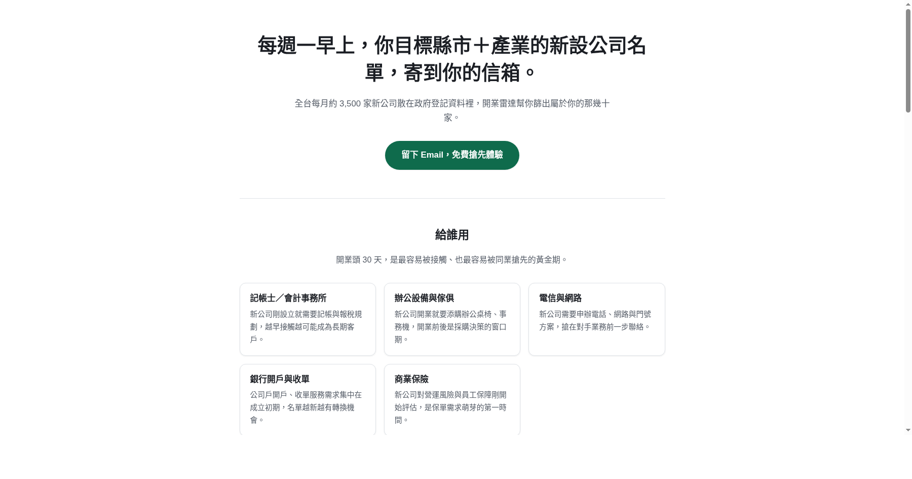

工作之外我一直在想一個問題：有沒有可能找到一種「公開資料 + 加工 + 收費」的小生意？篩選標準訂得很簡單——買家要能拿這份資料真的賺到錢、原始資料本身要夠難用（不然大家自己查就好）、而且資料要持續更新（一次性的東西沒有訂閱價值）。試過幾個方向後死掉的比活下來的多，這篇記錄目前唯一走到「有一頁能實測」階段的點子：**開業雷達**。

## 念頭從哪來

經濟部商工行政資料開放平臺每個月都會公布「公司設立登記清冊」——上個月（2026-06）全台新設公司 3,492 家，統編、名稱、地址、代表人、資本額、核准設立日期全部都在裡面，任何人都能下載。但這份資料是一份原始 CSV，沒有分類、沒有篩選介面，也沒人特別去整理。

會需要這份資料的人其實很明確：記帳士事務所、辦公設備商、電信門號業務、銀行開戶業務、商業保險業務——這些角色的共同點是「開業頭 30 天」是最好接觸的窗口，但沒有人有時間每個月手動翻幾千筆清冊找出屬於自己轄區、自己產業的那幾十家。

## 資料管線比想像中好接

清冊本身沒有電話跟 email（政府開放資料本來就不含個資，這點必須老實講在文案裡，不能暗示這是一份可以直接打電話的名單）。但經濟部商工行政資料開放平臺另外有一支「公司登記基本資料」API，可以用統編查到營業項目的中文說明，不需要金鑰。串起來大概是：

1. 每月抓一次清冊 CSV
2. 逐統編呼叫 API 補上營業項目
3. 依縣市＋營業項目篩選

實測下來管線是通的，這部分反而是整個專案裡最不擔心的環節。

## 先驗證，不寫產品

過去做過的東西裡，最貴的教訓是「沒被真實使用驗證過的需求，寫成程式就是未來要拆的債」。所以這次我逼自己只做一頁純靜態的 landing page，不寫後端、不接金流、不做會員系統——頁面上只有一顆 CTA 按鈕連到 Google 表單。

門檻訂在**收到 10 個 email**才算通過，沒達標就停損，不進入產品開發。頁面已經上線（[0zhen.github.io/newco-radar](https://0zhen.github.io/newco-radar/)），也接上 SEO 卡片方便分享到社群。

## 目前卡在哪

老實說，進度不快。目前累計 3 個 email，來源幾乎都是同一則發過的 Threads 貼文帶來的長尾流量，我本來規劃的「去對應的 Facebook/LINE 社團主動貼文」這一步還沒真的執行。換句話說，這個驗證目前還不算真的跑完——流量來源太單一，很難判斷 3/10 是「大家真的沒興趣」還是「我根本還沒讓對的人看到」。

如果你剛好認識做記帳士事務所、辦公設備、電信或保險業務開發的朋友，歡迎把[這個頁面](https://0zhen.github.io/newco-radar/)轉給他們看看，或者直接留言告訴我這個方向哪裡不對——比起自己埋頭做完再發現沒人要，我更想先確定這件事有沒有價值。
